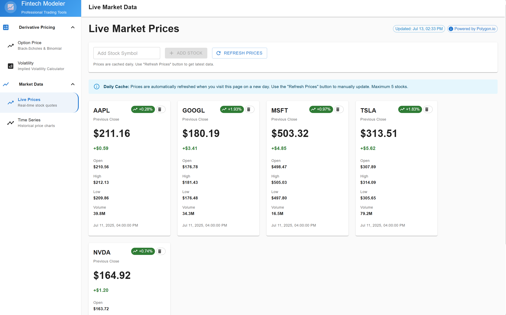

<div align="center">

# 📈 Fintech Modeler

**A sophisticated financial modeling application for option pricing and volatility calculations**

## 🌐 Live Application

**Try it now: [https://calm-beach-0abb2ea03.4.azurestaticapps.net/](https://calm-beach-0abb2ea03.4.azurestaticapps.net/)**

[](https://calm-beach-0abb2ea03.4.azurestaticapps.net/)

</div>

## 🖼️ Application Screenshots

<div align="center">

### Option Price Calculator
<p align="center">
    
</p>

### Black-Scholes Model Implementation
<p align="center">
    
</p>

### Volatility Calculator
<p align="center">
    
</p>

</div>

---

## ✨ Features

- 🔢 **Option Pricing Models**: Black-Scholes and Binomial pricing implementations
- 📊 **Volatility Calculations**: Advanced volatility assessment tools
- ⚡ **High Performance**: Dual Python and C++ implementations for optimal speed
- 🌐 **Modern Web Interface**: React-based frontend with intuitive design
- ☁️ **Cloud Native**: Fully deployed on Azure with container orchestration

## 🏗️ Architecture

The application leverages a modern microservices architecture:

- **🎨 Frontend**: React-based SPA deployed to Azure Static Web Apps
  - **Live URL**: https://calm-beach-0abb2ea03.4.azurestaticapps.net/
  - Real-time calculations and interactive charts
  - Responsive design for desktop and mobile

- **⚙️ Backend**: Spring Boot REST API on Azure Container Apps
  - Black-Scholes and Binomial option pricing models
  - RESTful APIs for pricing and volatility calculations
  - Containerized with Docker for scalability
  - Infrastructure as Code with Terraform

### 🛠️ Technology Stack

| Component | Technology |
|-----------|------------|
| Frontend | React, TypeScript, Material-UI |
| Backend | Spring Boot, Java 17, JNA |
| Compute Engine | C++ (Native DLL) |
| Cloud Platform | Microsoft Azure |
| Container Runtime | Docker |
| Infrastructure | Terraform |
| CI/CD | Azure DevOps |

## 🚀 Quick Start

### 🔧 Local Development

```bash
# 🎯 Backend Development
cd backend
./gradlew bootRun
# Backend available at http://localhost:8080

# 🎨 Frontend Development  
cd frontend
npm install
npm run dev
# Frontend available at http://localhost:3000
```

### ☁️ Production Deployment

The application automatically deploys to Azure:
- **Frontend**: Azure Static Web Apps (automatic deployment from Git)
- **Backend**: Azure Container Apps (Terraform-managed infrastructure)

## 📊 Performance Metrics

| Operation | Python Implementation | C++ Implementation | Speedup |
|-----------|----------------------|-------------------|---------|
| 50 calculations | 1.45ms | 0.07ms | **20.7x** |
| 1000 calculations | 6.78ms | 1.63ms | **4.2x** |
| 2000 calculations | 1.23ms | 3.19ms | Variable |

## 🏭 Infrastructure

Azure resources managed by Terraform:
- **Container Registry**: Secure container image storage
- **Container Apps Environment**: Shared runtime environment
- **Container App**: Scalable backend service
- **Managed Identity**: Secure service authentication

---

<div align="center">

**Built with ❤️ for the financial modeling community**

</div>
