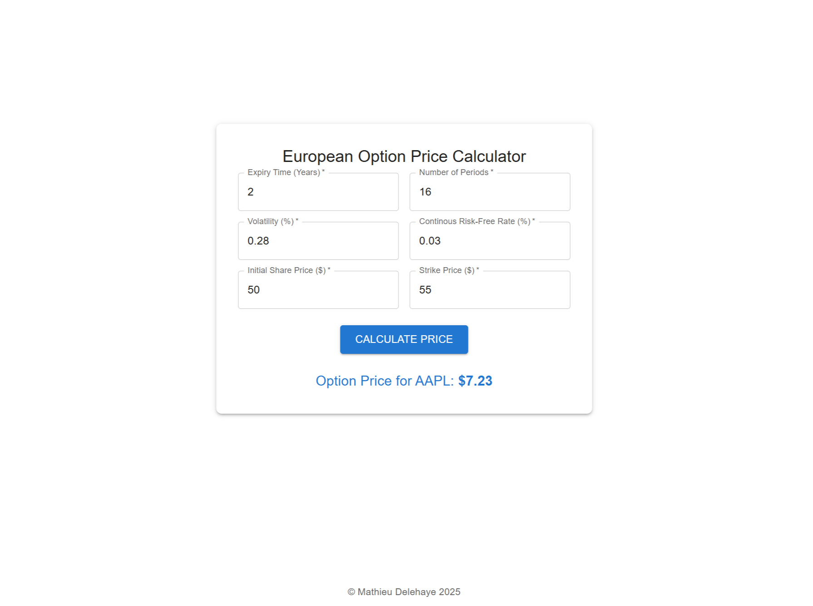

# FintechModeler

## Summary 

A Python and C++ application for fintech modelling:
- It implements the Black-Scholes model, in order to price call option derivatives, according to the underlying stock price, the strike price and the expiration date.
- The backend is a REST API implemented with Flask. It assesses the stock price variability with data from Yahoo Finance.
- The frontend is implemented with React and TypeScript.

This app let me predict with accuracy the option results from Saxo bank (SaxoTraderGO): https://www.home.saxo/platforms/saxotradergo

<p float="left">
  
</p>

## Details

The implementation is made both in Python with pandas and NumPy, as well as in C++, in order to compare the runtime performance of those programming languages for fintech applications.

## How-to guide

First, run some unit tests:
```
clear; python -m unittest -v tests.test_variability_assesser
```

Then build the C++ dynamic library:
```
cd <project root>
clear; g++ -shared -I cpp/include -std=c++17 -o cpp/build/operations.dylib -fPIC cpp/common/operations.cpp cpp/common/statistics_calculator.cpp 
```

Start the backend:
```
python run.py
```

Fetch the variability from the backend REST API:
```
curl 'http://localhost:5000/variability?start_month=6&end_month=2&stock_name=AAPL'
```

Start the frontend:
```
cd frontend
npm start
```

Manually calculate and plot the variability:
```
python
>>> import scripts.functions as f
>>> f.plot_variability('AAPL')
```

