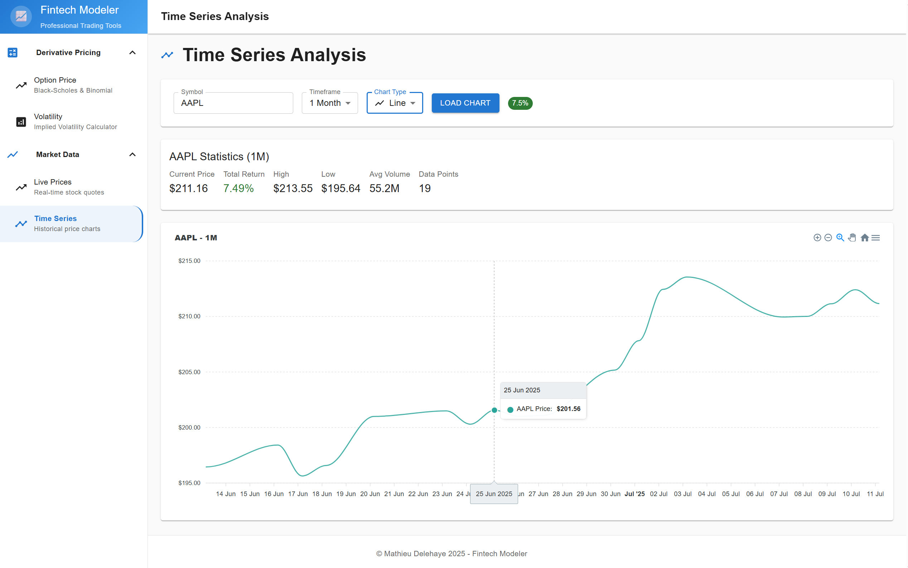

# 📈 Fintech Modeler

**A sophisticated financial modeling application for option pricing, volatility calculations, and real-time market data analysis**

## 🖼️ Application Screenshots




---

## ✨ Features

- 🔢 **Option Pricing Models**: Black-Scholes and Binomial pricing implementations
- 📊 **Volatility Calculations**: Advanced volatility assessment tools
- 📈 **Live Market Data**: Real-time stock prices and time series charts powered by Polygon.io API
- 📊 **Interactive Charts**: Candlestick and line charts for market data visualization
- 🎨 **Modern Dashboard**: Minimal UI-based dashboard with intuitive navigation
- ⚡ **High Performance**: Dual Python and C++ implementations for optimal speed
- 🌐 **Modern Web Interface**: Next.js and React-based frontend with responsive design
- 🔐 **Secure API Integration**: Next.js API Routes for secure API key management
- ☁️ **Cloud Native**: Fully deployed on Azure with container orchestration

## 🏗️ Architecture

The application leverages a modern microservices architecture:

### 🎨 Frontend: Next.js Application
- **Live URL**: https://calm-beach-0abb2ea03.4.azurestaticapps.net/
- Next.js framework with React and TypeScript
- Minimal UI dashboard components for clean, modern interface
- Real-time market data integration with Polygon.io API
- Interactive candlestick and line charts for time series visualization
- Secure API key management through Next.js API Routes
- Real-time calculations and interactive financial modeling tools
- Responsive design optimized for desktop and mobile

### ⚙️ Backend: Spring Boot REST API
- Black-Scholes and Binomial option pricing models
- RESTful APIs for pricing and volatility calculations
- Containerized with Docker for scalability
- Infrastructure as Code with Terraform

### 🛠️ Technology Stack

| Component | Technology |
|-----------|------------|
| Frontend | Next.js, React, TypeScript, Minimal UI |
| Market Data | Polygon.io API, ApexCharts |
| Backend | Spring Boot, Java 17, JNA |
| Compute Engine | C++ (Native DLL) |
| Cloud Platform | Microsoft Azure |
| Container Runtime | Docker |
| Infrastructure | Terraform |
| CI/CD | Azure DevOps |

## 🚀 Quick Start

### 🔧 Local Development

```bash
# 🎯 Backend Development
cd backend
./gradlew bootRun

# 🎨 Frontend Development  
cd frontend
npm install
npm run dev
# Frontend available at http://localhost:3000
```

### ☁️ Production Deployment

The application automatically deploys to Azure:
- **Frontend**: Azure Static Web Apps (automatic deployment from Git)
- **Backend**: Azure Container Apps (Terraform-managed infrastructure)

## 📊 Performance Metrics

| Operation | Python Implementation | C++ Implementation | Speedup |
|-----------|----------------------|-------------------|---------|
| 50 calculations | 1.45ms | 0.07ms | **20.7x** |
| 1000 calculations | 6.78ms | 1.63ms | **4.2x** |
| 2000 calculations | 1.23ms | 3.19ms | Variable |

## 🏭 Infrastructure

Azure resources managed by Terraform:
- **Container Registry**: Secure container image storage
- **Container Apps Environment**: Shared runtime environment
- **Container App**: Scalable backend service
- **Managed Identity**: Secure service authentication

---


<div align="center">

**Built with ❤️ for the financial modeling community**

⭐ **Star this repository if you found it helpful!**

</div>
