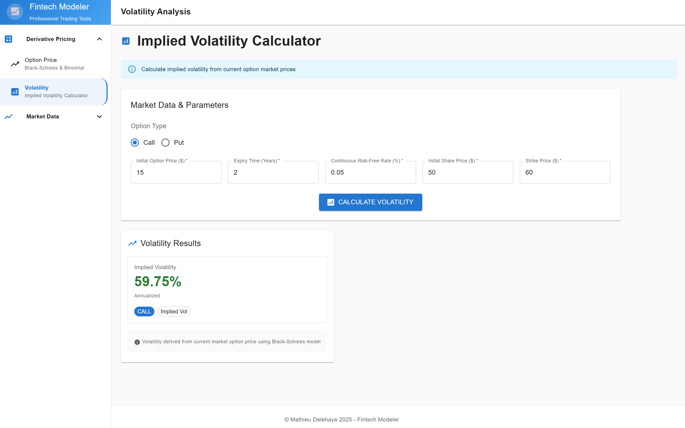

# FintechModeler

## Summary 

A financial and fintech application built with C++, Python, C# ASP.NET (backend), and TypeScript React (frontend).

It calculates the price of European-style call options using an exponentiated biased lattice random walk within a multi-period binomial tree model.

<kbd>
  
</kbd>

## Additional Features

- Black-Scholes Model Implementation: accurately prices European call options based on the underlying stock price, strike price, and expiration date.
- Real-Time Financial Data Access: retrieves and analyzes stock price variability using live data from the Yahoo Finance API.
- Data Analysis: uses Python's Pandas, NumPy, and Matplotlib for financial modeling and visualization.

These features enable accurate option price predictions, aligning closely with real-world results from Saxo Bank (SaxoTraderGO): https://www.home.saxo/platforms/saxotradergo

<kbd>
  
</kbd>

<br/>

## Details

The implementation is made both in Python with pandas and NumPy, as well as in C++, in order to compare the runtime performance of those programming languages for fintech applications.

## How-to guide

First, run some unit tests:
```
clear; python -m unittest -v tests.test_variability_assesser
```

Then build the C++ dynamic library:
```
cd <project root>
clear; g++ -shared -I cpp/include -std=c++17 -o cpp/build/operations.dylib -fPIC cpp/common/operations.cpp cpp/common/statistics_calculator.cpp 
```

Start the backend:
```
python run.py
```

Fetch the variability from the backend REST API:
```
curl 'http://localhost:5000/variability?start_month=6&end_month=2&stock_name=AAPL'
```

Start the frontend:
```
cd frontend
npm start
```

Manually calculate and plot the variability:
```
python
>>> import scripts.functions as f
>>> f.plot_variability('AAPL')
```

